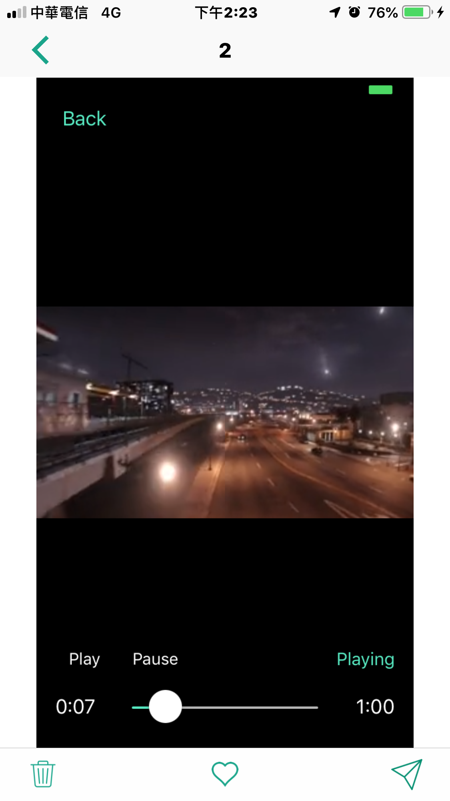

# IRGallery 

- IRGallery is a powerful gallery for iOS.

## Features
- Single tap fullscreen mode.
- Double tap image zooming.
- Pinch zooming.
- Captions.
- Rotation support.
- Load images locally or from a web URL.
- Custom UITabBarItems.
- Default UITabBarItems:
    - Delete.
    - Favorite.
    - Share.

## Install
### Git
- Git clone this project.
- Copy this project into your own project.
- Add the .xcodeproj into you  project and link it as embed framework.
#### Options
- You can remove the `demo` and `ScreenShots` folder.

### Cocoapods
- Add `pod 'IRGallery'`  in the `Podfile`
- `pod install`

## Usage

### Basic
```obj-c
@import IRGallery;

IRGalleryViewController *galleryVC = [[IRGalleryViewController alloc] initWithPhotoSource:self];
galleryVC.startingIndex = indexPath.row;
galleryVC.delegate = self;
[galleryVC gotoImageByIndex:indexPath.row animated:NO];
[self.navigationController pushViewController:galleryVC animated:YES];
```

- Use `IRGalleryViewControllerSourceDelegate`.
```obj-c
#pragma mark - IRGalleryViewControllerDelegate

- (int)numberOfPhotosForPhotoGallery:(IRGalleryViewController *)gallery {
    return images.count;
}

- (IRGalleryPhotoSourceType)photoGallery:(IRGalleryViewController *)gallery sourceTypeForPhotoAtIndex:(NSUInteger)index {
    return IRGalleryPhotoSourceTypeLocal;
}

- (NSString*)photoGallery:(IRGalleryViewController *)gallery captionForPhotoAtIndex:(NSUInteger)index {
    NSString *filename = [NSString stringWithFormat:@"%d", index + 1];
    return [[filename pathComponents] lastObject];
}

- (NSString*)photoGallery:(IRGalleryViewController *)gallery urlForPhotoSize:(IRGalleryPhotoSize)size atIndex:(NSUInteger)index {
    return nil; // network url
}

- (NSString*)photoGallery:(IRGalleryViewController*)gallery filePathForPhotoSize:(IRGalleryPhotoSize)size atIndex:(NSUInteger)index {
    NSString *path = [NSBundle.mainBundle URLForResource:images[index] withExtension:nil].path;
    return path;
}

- (bool)photoGallery:(IRGalleryViewController*)gallery isFavoriteForPhotoAtIndex:(NSUInteger)index{
    return NO;
}

```

### Advanced settings

- Use `IRGalleryViewControllerDelegate`.
```obj-c
- (void)photoGallery:(IRGalleryViewController*)gallery deleteAtIndex:(NSUInteger)index;
- (void)photoGallery:(IRGalleryViewController*)gallery addFavorite:(bool)isAddToFavortieList atIndex:(NSUInteger)index;
```

- Make your custome Bar Items.
```obj-c
NSMutableArray *_barItems;
UIBarButtonItem *_deleteButton;
UIBarButtonItem *_favoriteButton;
UIBarButtonItem *_sendButton;

UIButton* doDeleteButton = [[UIButton alloc] initWithFrame:CGRectMake(0, 0, 40, 50)];

UIImage *image = [UIImage imageNamedForCurrentBundle:@"btn_trash"];
image = [Utility imageWithImage:image scaledToSize:CGSizeMake(20, 26.67)];
[doDeleteButton setImage:image forState:UIControlStateNormal];
image = [UIImage imageNamedForCurrentBundle:@"btn_trash"];
image = [Utility imageWithImage:image scaledToSize:CGSizeMake(20, 26.67)];
[doDeleteButton setImage:image forState:UIControlStateHighlighted];
[doDeleteButton addTarget:self action:@selector(deleteClk:) forControlEvents:UIControlEventTouchUpInside];
_deleteButton = [[UIBarButtonItem alloc] initWithCustomView:doDeleteButton];

UIButton* doFavoriteButton = [[UIButton alloc] initWithFrame:CGRectMake(0, 0, 40, 50)];
image = [UIImage imageNamedForCurrentBundle:@"btn_video_heart"];
image = [Utility imageWithImage:image scaledToSize:CGSizeMake(21.4, 20)];
[doFavoriteButton setImage:image forState:UIControlStateNormal];
image = [UIImage imageNamedForCurrentBundle:@"btn_video_heart"];
image = [Utility imageWithImage:image scaledToSize:CGSizeMake(21.4, 20)];
[doFavoriteButton setImage:image forState:UIControlStateHighlighted];
image = [UIImage imageNamedForCurrentBundle:@"btn_heart_h"];
image = [Utility imageWithImage:image scaledToSize:CGSizeMake(21.4, 20)];
[doFavoriteButton setImage:image forState:UIControlStateSelected];
[doFavoriteButton addTarget:self action:@selector(addToMyFavoritesClk:) forControlEvents:UIControlEventTouchUpInside];
_favoriteButton = [[UIBarButtonItem alloc] initWithCustomView:doFavoriteButton];

UIButton* doSendButton = [[UIButton alloc] initWithFrame:CGRectMake(0, 0, 40, 50)];
image = [UIImage imageNamedForCurrentBundle:@"btn_video_send"];
image = [Utility imageWithImage:image scaledToSize:CGSizeMake(25, 25)];
[doSendButton setImage:image forState:UIControlStateNormal];
image = [UIImage imageNamedForCurrentBundle:@"btn_video_send"];
image = [Utility imageWithImage:image scaledToSize:CGSizeMake(25, 25)];
[doSendButton setImage:image forState:UIControlStateHighlighted];
[doSendButton addTarget:self action:@selector(shareClk:) forControlEvents:UIControlEventTouchUpInside];
_sendButton = [[UIBarButtonItem alloc] initWithCustomView:doSendButton];

[_barItems insertObject:_sendButton atIndex:0];
[_barItems insertObject:_favoriteButton atIndex:0];
[_barItems insertObject:_deleteButton atIndex:0];

IRGalleryViewController *galleryVC = [[IRGalleryViewController alloc] initWithPhotoSource:self barItems:_barItems];
```

## Screenshots
| List | Gallery |
|:---:|:---:|
|  |  |
| Delete | Favorite |
|  |  |
| Share | Scale |
|  |  |

| Landscape |
|:---:|
|  |

## Copyright
##### This project is inspired from [FGallery-iPhone](https://github.com/gdavis/FGallery-iPhone).
